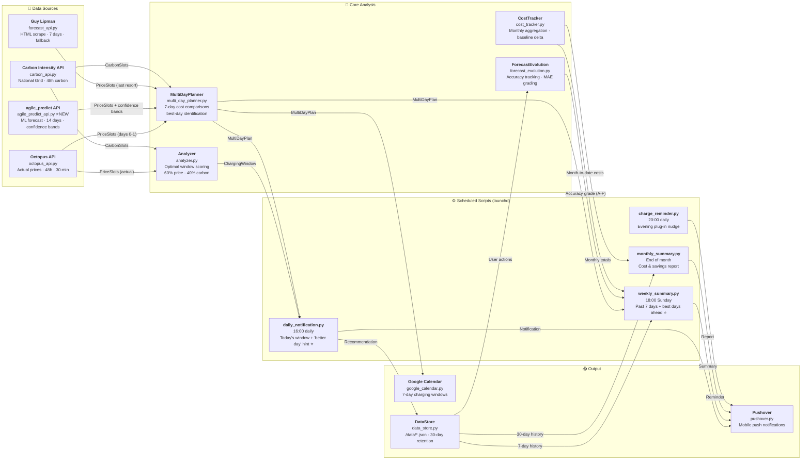

# EV Charging Optimizer — Architecture Overview

Fishbone / dependency diagram for the full system. Render with VS Code Markdown Preview
(install "Markdown Preview Mermaid Support" extension if diagrams don't display).

## System Fishbone



## Data Source Priority (Fallback Chain)

```
Day 0-1:  Octopus actual prices  (published daily ~16:00 UTC)
Day 2-14: agile_predict API      ← NEW primary forecast source
Day 2-7:  Guy Lipman scrape      ← fallback if agile_predict unavailable
```

## Key Data Models

| Model | File | Fields |
|---|---|---|
| `PriceSlot` | analyzer.py | `time, price (p/kWh), source` |
| `CarbonSlot` | analyzer.py | `time, intensity (gCO2/kWh)` |
| `ChargingWindow` | analyzer.py | `start, end, avg_price, avg_carbon, rating, score, savings_vs_baseline` |
| `DayComparison` | multi_day_planner.py | `date, day_name, avg_price, cost, rating, price_source, savings_vs_today` |
| `MultiDayPlan` | multi_day_planner.py | `days[], best_day, kwh_amount` |

## Notification Triggers

| Condition | Priority | Sound |
|---|---|---|
| Negative pricing | 2 (emergency) | cashregister |
| EXCELLENT rating | 1 (high) | cashregister |
| Price ≤ 8p/kWh | 1 (high) | cashregister |
| Savings ≥ £1.50 | 0 (normal) | cosmic |
| Otherwise | skipped | — |

## Config Location

All user-tunable settings: `config/config.yaml`
Secrets (Pushover keys): `.env` file
